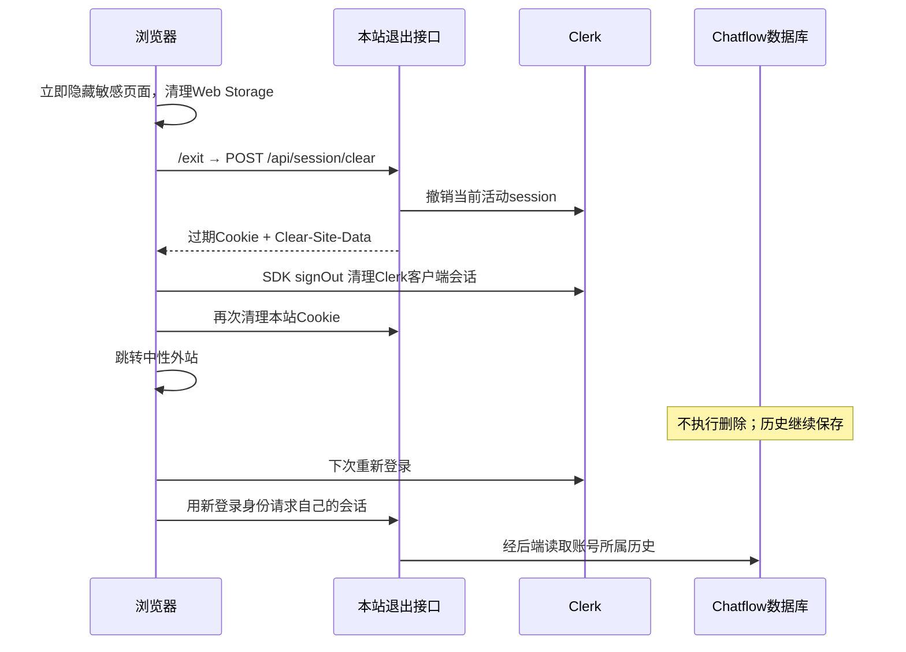

# Clerk 身份、回答反馈、管理员与快速退出

2026-10-09。本文件描述本次已实现的代码、启用步骤和仍需现场验证的部分。

## 当前行为

- 聊天需要 Clerk 登录，新会话归属于后端账号，清除本地 Cookie 后也能重新登录读取历史。
- 普通用户可读取自己的聊天、给自己的已完成回答打 1–5 分并提交最多 500 字建议。
- `admin` 可访问 `/feedback` 和 `GET /api/feedback`，分页查看活跃账号及未过期游客会话、已完成回答和评价。
- 普通用户提交使用独立的 `/api/reviews`；管理员 `/api/feedback` 不接受普通用户查询，也不再接受浏览器上传的聊天记录。
- 管理员读取对话会写入访问审计，不读取后端 debug/state 内部推理数据。
- 资源、故事、心理资料、文书模块继续保留。

## 权限矩阵

| 能力 | 未登录 | 普通用户 | admin |
| --- | --- | --- | --- |
| 首页与资源/故事/文书 | 可访问 | 可访问 | 可访问 |
| 聊天及自己的历史 | 登录后可用 | 可用 | 可用 |
| POST /api/reviews | 401 | 仅自己的已完成回答 | 同样仅自己的回答 |
| GET /api/reviews | 401 | 仅自己的评价 | 同样仅自己的评价 |
| /feedback | 跳转登录 | 不展示管理页面 | 可访问 |
| GET /api/feedback | 401 | 403 | 可访问 |
| 管理员查看其他用户对话 | 不可用 | 不可用 | 分页、只读、审计 |
| 改角色 | 无应用接口 | 无应用接口 | 在有权访问的 Clerk Dashboard 中管理 |

所有服务端入口通过 `lib/auth/server.ts` 验证 Clerk 会话，并调用 Clerk API 检查 session 仍 active、账号没有 banned/locked。角色实时读取服务端 User `publicMetadata.role`，缺失或未知角色一律为 user。没有信任 unsafeMetadata、浏览器传入的 role/userId 或旧 feedback_auth Cookie。

Clerk 网络不可用时，私有数据接口返回 503，不降级为游客或管理员。每次访问需要 Clerk 实时验证，会增加网络延迟和 Clerk API 使用量；应在真实公测负载下测量。

## 1. 配置 Clerk

1. 使用与 XiaoAn 后端相同的 Clerk application，并配置前端站点的允许域名及登录/注册方式。
2. 在本项目环境填入 `NEXT_PUBLIC_CLERK_PUBLISHABLE_KEY` 和 `CLERK_SECRET_KEY`，按照 `.env.example` 设置 sign-in/up 路径。
3. 在 Clerk Dashboard 的目标用户 Public metadata 设置 `{"role":"admin"}`；普通用户可设置 `{"role":"user"}` 或留空。首次管理员需要由拥有 Clerk 管理权限的人明确指定，不会自动把首位注册者变成管理员。
4. 角色变更由 Clerk 管理端完成；应用没有普通用户可调用的角色提升接口。由于每次从 Clerk API 读取角色，不需要额外 session metadata 模板。
5. 正式上线使用生产 Clerk 实例；检查同一客户端多账号会话设置。正常退出流程会调用 Clerk signOut 清理客户端会话，服务端同时撤销当前活动 session。

参考：[Clerk metadata RBAC](https://clerk.com/docs/guides/secure/basic-rbac)、[读取用户/会话](https://clerk.com/docs/nextjs/guides/users/reading)、[撤销 session](https://clerk.com/docs/reference/backend/sessions/revoke-session)。集成依赖为适配当前 Next.js 15 的 `@clerk/nextjs` 6.x；更换大版本需单独验证。

## 2. 配置后端和数据库

`BACKEND_API_URL` 为源地址，不附 `/v1`；`FRONTEND_ORIGIN` 是浏览器访问当前站点的真实 Origin，必须加入后端 Clerk authorized parties/Origin allowlist。

网关从已验证的 Clerk 会话获取 token，服务端通过 Authorization Bearer 传给后端。客户端无法指定其他用户身份。普通聊天不携带旧游客凭证；只有用户明确点击“关联旧游客记录”时才允许 `/v1/me/claim-guest` 带游客 Cookie。

`BACKEND_API_KEY` 仅用于额外 API 网关；必须使用 x-api-key、api-key 或其他支持的独立头，不能覆盖 Authorization。冲突配置返回 503。

反馈与管理员数据层使用 `pg` 连接 `CHATFLOW_DATABASE_URL`，**必须指向与后端账号服务相同的 PostgreSQL 数据库**。业务库已有以下表：

- `app_users`：Clerk user ID 到业务账号 ID 的映射及账号状态。
- `account_conversations`：归属、创建时间、游客有效期。
- `account_turns`：已提交的成功轮次、response_id、正文。

本次新增 `db/migrations/001_answer_feedback.sql`：

- `xiaoan_answer_feedback`：每个 response_id 一条可更新的评价；保存评分、建议和评价者身份，不复制聊天正文。
- `xiaoan_admin_access`：管理员读取列表/会话的审计，不记录正文、密钥或 session token。

迁移没有在程序启动或 API 请求中自动执行，**本轮未执行任何数据库迁移或读写线上数据**。

部署时使用独立数据库角色：对上述后端业务表只授予 SELECT；反馈表授予所需 SELECT/INSERT/UPDATE；审计表授予 INSERT 与序列权限。迁移由另一个拥有 DDL 权限的角色执行。生产连接启用并核验 TLS，勿把数据库凭证放入 NEXT_PUBLIC 变量。

所有评价写入用一条参数化 INSERT…SELECT 核对回答、会话、当前账号归属及 active 状态；不接受 userId、role、chatList 等额外字段。账号或会话真正被删除时，评价随回答外键级联删除；**退出登录不触发任何业务数据删除**。

旧 Neon feedback_entries 表没有被删除或迁移，新后台不展示这套旧镜像数据。保留旧数据的转换策略需要另行决定。

## 3. 退出与恢复

本站接口过期 `/`、`/v1`、`/feedback` 下的已知会话 Cookie，包括旧 session_id、feedback_auth；同时过期本次请求中可见的其他本站 Cookie。设置 `Clear-Site-Data: "cookies", "storage", "cache"`，并由 Clerk SDK 处理 Clerk 自己域上的退出。

生产若使用父域 Cookie，需配置 `FRONTEND_COOKIE_DOMAIN`。不存储识别码、聊天正文或登录 token 到 localStorage/sessionStorage。登录状态下 Clerk 仍需要会话 Cookie；“不留 Cookie”指完成退出后的状态。

Cookie 全路径/父域与不同浏览器的 Clear-Site-Data 行为需要 HTTPS 实机验收，本地单元测试只验证响应头与调用行为。网络断开或 Clerk 不可用时，退出页明确显示“退出尚未完全确认”，提供重试或立即离开；不会把未完成清理显示为已成功。离线无法向浏览器交付服务器清理响应。

没有 Cookie 后，服务端 `/current` 通常无法选择会话；客户端登录初始化先列出该账号的历史，再在没有 current 时读取列表第一条。游客记录只有在 Cookie 仍存在时明确认领到账号才可跨退出恢复；清除游客凭证后不会猜测归属。

## 4. 已执行的精简

按此前批准清单移除了 95 个入口不可达源码/样式文件，以及 public/vs 下 113 个旧 Monaco 文件。共 208 个文件在删除前备份到 `/tmp/frontend-approved-cleanup-20261009.zip`。

移除旧 workflow、thought、prompt 配置 UI、旧身份码 hook、上传器、旧 Markdown 客户端和反馈广播工具；保留仍使用的 image-preview、基础按钮/弹层、品牌图和全部业务内容页。移除了 29 项旧直接依赖（含旧 Neon 驱动），新增 Clerk SDK、pg 与 pg 类型；pnpm 锁已更新。

保留旧聊天 410 路由作为退役提示；没有删除旧反馈业务数据、历史资料或许可证。评分弹窗已重做为有键盘支持的 dialog，保存成功后才关闭，失败留在原地供重试。

## 5. 验证与启用状态

本地通过：

- 24 项原生协议/网关测试：SSE、Cookie、身份转发、未登录拒绝、密钥不覆盖 Clerk token。
- 16 项权限与反馈测试：角色默认值/撤销、失效 session、普通用户拒绝、评分归属、伪造字段、审计调用、退出不删历史。
- 定向 TypeScript 检查覆盖聊天、Clerk 页面、反馈 API/后台及退出接口。
- 本次核心改动 ESLint。

权限测试 mock Clerk/数据库；未连接真实 Clerk、未执行 SQL 迁移、未验证真实 PostgreSQL 执行计划/约束或浏览器 Cookie 结果。尚未执行完整构建/E2E、部署或提交。

检查本项目 `.env.local` 时，Clerk 两个 Key、BACKEND_API_URL、FRONTEND_ORIGIN、CHATFLOW_DATABASE_URL 均未配置。因此当前是**实现完成、等待环境接入和联调**，还不能宣称已在公测环境启用。

启用顺序：配置同一 Clerk application与admin → 配置后端允许来源 → 审核并执行评分表迁移 → 注入数据库权限受限的连接 → 两个普通账号加一个admin验收 → HTTPS退出/重新登录恢复 → 完整构建与部署。

## PR 与最新 main 的整合

PR 基于最新 `origin/main`（b425974）创建，保留其 TypeScript/ESLint 构建门禁、`/safety-pack`、CrisisDialog 和逐帧流式平滑；原生 hook 已接入渲染器，危机弹窗只对新完成的危险级别回答触发。移除了旧 `/v1` 直接 rewrite，所有原生请求经 Clerk 网关。浏览器回归需提供 `CLERK_E2E_STORAGE_STATE`（已登录测试用户的受保护本地文件，勿提交）；未配置时明确跳过。没有运行该浏览器套件。
