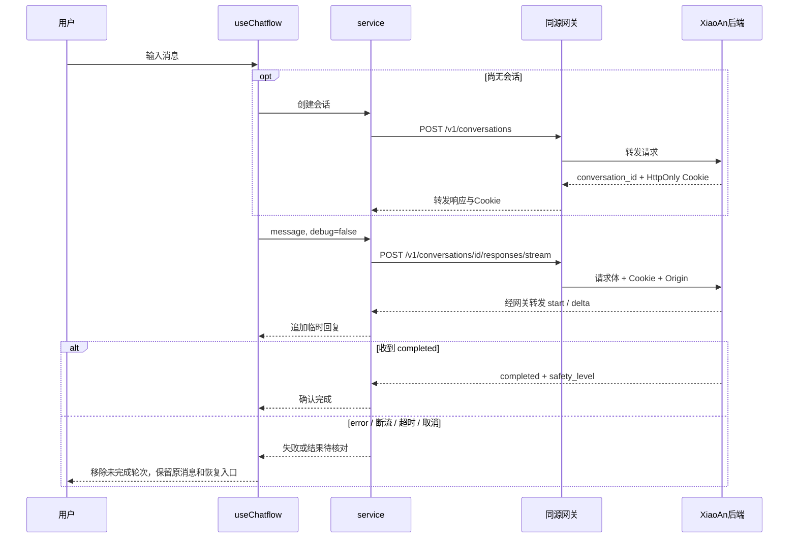

# 小安前端项目说明与精简建议

> **2026-10-09 更新：** 下文保留为迁移/审查快照。95 个遗留源码/样式及旧 Monaco 资源已按批准清单清理；反馈保留并迁到 Clerk user/admin 权限，评分写入原生会话库，快速退出清 Cookie、保留历史。当前实现与配置以 [Clerk/反馈启用说明](./CLERK_FEEDBACK_SETUP.md) 为准。

核对日期：2026-10-08。范围：当前本地工作树，包含尚未提交的界面修改与原生 Chatflow 迁移。

## 1. 项目现在负责什么

这是一个 **Next.js 网站与服务端网关组合应用**。浏览器页面负责聊天与资源展示，Next.js 服务端负责转发聊天请求、生成 Word 文档、接收联系留言，并保留了一套旧反馈管理后台。

模型推理、Safety 分类、Router、Ground 与会话持久化由独立的 `xiaoan` 后端承担。本仓库没有实现这些模型流程；Azure 是后端部署环境，不是一种 API 协议。当前聊天按 `xiaoan/tech/chatflow/poc/API.md` 中的 `/v1` 协议运行。

最合理的精简方向是：**保留聊天、资源内容和所需文书工具，删除已经离开入口引用链的模板模块；单独决定旧反馈后台和联系留言是否继续保留。**

## 2. 整体关系

```mermaid
flowchart TD
  Browser[浏览器] --> Site[Next.js 页面与共享布局]
  Site --> Chat[聊天页面与状态管理]
  Chat --> Client[service/index.ts 原生 API 客户端]
  Client --> Gateway[本站 /v1 网关]
  Gateway --> Backend[独立 XiaoAn Chatflow 后端]
  Backend --> Models[模型与 Safety / Router / Ground]
  Backend --> History[后端会话数据库]
  Site --> Content[资源 / 故事 / 心理资料]
  Site --> Forms[文书填写页面]
  Forms --> DocAPI[/api/generate-doc]
  DocAPI --> Word[Word 下载]
  Site --> Contact[首页联系表单]
  Contact --> ContactAPI[/api/contact]
  ContactAPI --> JSONL[服务端 contacts.jsonl]
  Site --> Admin[旧反馈管理页面]
  Admin --> FeedbackAPI[/api/feedback]
  FeedbackAPI --> FeedbackDB[单独配置的反馈数据库]
```

有三套不同的数据路径：聊天记录进入小安后端；旧反馈记录进入前端配置的数据库；联系留言进入前端容器文件。当前代码没有把三者同步成一个统一数据系统。

## 3. 页面职责与依赖

| 访问路径 | 入口 | 作用及关系 |
| --- | --- | --- |
| `/` | `app/page.tsx` | 小安介绍、业务入口、品牌插画、联系表单；进入 `/chat` 和内容页 |
| `/chat` | `app/chat/page.tsx` | 渲染 `app/components/index.tsx`，组合聊天、历史侧栏与资源面板 |
| `/resources` | `app/resources/page.tsx`、`data.ts` | 从仓库静态数据展示求助资源 |
| `/psych-resources` | `app/psych-resources/page.tsx`、`data.ts` | 展示心理支持资料 |
| `/stories`、`/stories/[id]` | `app/stories/` | 列表与故事详情，共用 `data.ts` |
| `/docs-toolkit`、`/docs-toolkit/[templateId]` | `app/docs-toolkit/` | 选择文书模板、填写字段并请求 Word 下载 |
| `/feedback` | `app/feedback/page.tsx` | 管理员轮询旧反馈 API、查看记录与导出；不是普通用户留言页 |

首页导航目前把 `/feedback` 标为“有话要说”，实际却指向管理员页面。应将导航改到首页联系表单，或为普通用户建立单独反馈入口；下线后台时也要同步移除这个导航。

### 所有页面共用的内容

- `app/layout.tsx`：HTML 布局、SEO metadata、Google Fonts、QuickExit，以及 Vercel Analytics / Speed Insights。
- `app/styles/globals.css`：全站基础样式；`figma-home.css` 与 `figma-chat.css` 分别服务当前首页和聊天页。
- `config/brand-assets.ts` → `public/brand/`：统一品牌图路径，当前页面确实使用，应保留。
- `config/index.ts`：名称、简介、版权和语言等。仍有旧 APP_ID/提示词常量，可随旧模块一起精简。
- `app/sitemap.ts`、`app/robots.ts`、各页面 `layout.tsx`：搜索引擎和页面元信息。

## 4. 聊天模块：每一层做什么

| 层次 | 文件 | 职责 |
| --- | --- | --- |
| 页面布局 | `app/components/index.tsx` | 组合 Header、Sidebar、Chat、ResourcePanel；错误/重试入口；按需加载 xlsx 导出 |
| 会话状态 | `hooks/use-chatflow.ts` | 初始化与恢复、选择会话、发送锁、临时回复、失败恢复、删除与清空 |
| 输入与消息展示 | `app/components/chat/index.tsx` | 输入框、发送、快捷问题、Question / Answer 渲染 |
| 回答渲染 | `app/components/chat/answer/index.tsx` | 小安头像、回复内容和正在回复状态；旧评价实现尚留在组件中，但主聊天入口关闭了评价能力 |
| Markdown | `app/components/base/streamdown-markdown.tsx` | 使用 Streamdown 渲染文本，并导入 KaTeX 样式 |
| 会话列表 | `app/components/sidebar/index.tsx` | 历史选择、创建入口、删除确认；真正删除由 hook 调用 API |
| 资源推荐 | `app/components/resource-panel/index.tsx` | 按回答文本中的关键词排序站内资源链接；没有调用模型，也不是后端 Ground 检索结果 |
| 浏览器 HTTP/SSE | `service/index.ts` | 相对 `/v1` 请求、Cookie、列表/历史分页、流式状态校验 |
| 协议类型 | `types/chatflow.ts` | 小安会话、轮次、完成事件和安全等级 |
| UI 类型 | `types/app.ts` | ChatItem 等展示结构，同时仍混有旧提示词、附件和 workflow 类型 |
| Next.js 入口 | `app/v1/[...path]/route.ts` | 交给网关处理 GET/POST/DELETE |
| 网关规则 | `app/api/utils/proxy.ts` | 限制路径/方法，检查写请求 Origin，筛选 Cookie，转发响应及多条 Set-Cookie |
| 服务端传输 | `lib/backend.ts` | 读取私有后端地址/可选网关密钥，禁止缓存和重定向，执行 fetch |

### 一轮消息如何完成



- 刷新通过 `/conversations/current` 找到当前会话，再按 ID 分页读取完整历史。
- 后端 current Cookie 与“正在查看的历史会话”并不总一致：当前按 ID 的读取接口不更新 current，刷新会恢复后端当前选择。
- 只有 `completed` 才确认成功。失败后不自动重复生成；先读取服务端记录，再由用户手动重试。
- `safety_level` 已保存在 UI 记录中，目前没有专门基于它显示不同级别的危机提示组件。
- 当前是游客 Cookie 模式；Clerk 登录、认领记录、注销账号尚未接入本前端。
- 附件、改名、单条消息删除和远端评分均没有接入原生 API。

## 5. 非聊天功能与数据去向

### 文书工具

`app/docs-toolkit/templates.ts` 定义模板和表单字段；详情页把 `templateId` 与 `fields` 发给 `/api/generate-doc`。后者用 `docx` 在服务端构造文档，返回下载内容。

这条链路不经过 Chatflow，也不调用大模型。保留文书功能就必须保留模板、页面、生成路由和 `docx`。前端字段与服务端文档模板分别维护，修改字段时需要两边核对。

### 联系表单

首页 `ContactForm` → `POST /api/contact` → `contacts.jsonl`。开发默认写项目 `data/`，生产默认写 `/tmp/adv-contacts/`，可以用 `DATA_DIR` 改变位置。

读取留言的 GET 接口通过 URL 中的 `secret` 比较 `CONTACT_ADMIN_SECRET`，且代码存在固定默认值。应改为明确的管理员认证，并将生产留言迁入持久存储；容器临时文件不能承担跨实例共享记录。

### 旧反馈管理

`/feedback` 页面轮询 `/api/feedback`；API 通过 `@neondatabase/serverless` 访问环境变量配置的数据库，并创建/读写 `feedback_entries`。这是单独的一条旧数据链，不会自动读取 Azure Chatflow 会话库。

旧聊天广播工具 `utils/feedback-broadcast.ts` 已没有当前页面入口调用，因此新聊天不再自动进入旧后台。但后台页面及 API 路由依然存在，仍可能被访问。

**需优先处理：** 当前 `middleware.ts` 只匹配 `/feedback` 页面；`/api/feedback` GET/POST 没有同等身份校验。配置数据库后，这些路由在仓库代码层面存在未鉴权读写路径。应给 API 加同等认证，或整体下线旧后台。此次仅检查源码，未请求线上记录。

另外，数据库地址缺失会在 `app/api/feedback/route.ts` 模块加载阶段直接抛错。即使聊天不使用它，保留路由仍有环境配置负担；此前 README 所称“聊天不需要该数据库”只描述聊天调用链。

## 6. 隐私、语言与部署的横向关系

| 模块 | 当前行为 | 调整方向 |
| --- | --- | --- |
| QuickExit | 全站悬浮退出和 Escape；清理 localStorage/sessionStorage，保留旧 user hash，然后跳转外站 | 保留功能；去掉旧身份码保留逻辑，明确“快速离开”和“删除记录”的不同操作 |
| BackExitGuard | 聊天页监听浏览器返回并触发 QuickExit | 与 QuickExit 一起维护和验收 |
| 原生会话 | HttpOnly Cookie + 后端会话记录 | 清理 Web Storage 不会清除 Cookie/服务端记录；如要提供删除/结束会话功能，应走明确 API 流程 |
| i18n | 服务端读 locale Cookie/语言头，客户端导入多语言资源；聊天将语言设为中文 | 当前大量内容为中文硬编码；若只做中文，应先统一 locale 流程，再裁剪字典 |
| SEO | 多处硬编码 `anti-dv.vercel.app` | 换正式域名时统一 metadata、sitemap、robots 与页面 canonical |
| Vercel 监测 | 根布局仍导入 Analytics / SpeedInsights | 是否保留由观测需求决定；迁往 Azure 不会让这些 import 自动消失 |
| Docker | Node 22、pnpm 冻结锁、多阶段构建、非 root 运行 | 运行时提供后端地址和本站 Origin；容器构建还需实际验收 |
| TypeScript | 主 tsconfig 收录全项目 TS/TSX；专项配置只覆盖聊天链 | 删除旧源码后再删除其包，否则全量类型检查仍可能解析旧 import |
| 构建门禁 | next.config.js 仍忽略 TypeScript/ESLint 构建错误 | 完成全量基线修复后恢复门禁 |

`robots.ts` 当前通用规则包含 `/api/`、`/chat`、`/feedback`，没有显式列出新增 `/v1/`。可同步更新爬虫规则；真正访问控制仍由 API 与会话认证承担。

## 7. 工程目录导航

| 目录/文件 | 用途 | 保留判断 |
| --- | --- | --- |
| `app/` | 页面、布局、路由处理器、组件和内容数据 | 按模块精简，不能整目录删除 |
| `hooks/`、`service/`、`lib/` | UI 状态、浏览器 API、服务端传输 | 保留原生聊天链；旧 hook/base 客户端可成组移除 |
| `config/`、`types/`、`utils/` | 品牌/站点配置、类型和工具 | 混有活跃与遗留内容，按引用清单处理 |
| `i18n/` | 多语言字典与语言选择 | 仍被布局和聊天使用 |
| `public/brand/` | 当前品牌素材 | 保留 |
| `public/vs/` | 旧 Monaco 编辑器静态资源，约 12 MiB | 随旧 workflow 编辑器优先清理 |
| `tests/chatflow.test.cjs` | 原生 API/SSE/代理专项测试 | 保留 |
| `load-test/`、`locustfile.py` | 历史负载与 UI 压测脚本 | 先归档/改造；旧脚本还请求 chat-messages，不能直接代表原生协议验收 |
| `.github/`、`.husky/` | CI、开发规则、Git hooks 等 | 工程工具需看配置引用，不能按页面 import 判断 |
| `prompts/`、`memory/`、`seo_audit_memory/` | 项目历史报告、研究与工作记录 | 不参与线上功能；先确认保留价值，可迁到统一 docs/archive |
| `docs/` | 项目说明与迁移/删除审查记录 | 保留 |
| `temp_clone/` | 当前仅约 4 KiB 的 `.git` 残留目录；Git 查询实际回退到主项目 | 不把它当独立克隆或大体积优化目标；先核对残留内容再清理 |
| `.next/`、`node_modules/` | 约 326 MiB 构建缓存、901 MiB 安装依赖 | 可重建，不是模板业务代码；清理会影响本地运行，通常不优先 |
| `package.json`、`pnpm-lock.yaml` | 直接依赖、脚本与可复现安装 | 使用 pnpm 统一维护；本地 npm lock 被忽略 |
| `LICENSE` | 原始 MIT 许可与来源记录 | 保留 |

体积为当前机器 `du -sh` 的近似磁盘占用，不是浏览器包体积，也不是删依赖后的净收益。

## 8. 删除结论与实施顺序

详见 [清理候选清单](./CLEANUP_CANDIDATES.md)。建议按以下顺序执行：

1. 优先决定旧反馈后台去留，修复或下线未鉴权 API。
2. 成组删除不再被入口引用的 workflow、上传器、旧身份码与提示词配置模块。
3. 删除这些模块独占的直接依赖，统一重生成 pnpm lock，并做干净安装验证。
4. 决定旧 `/api` 410 路由保留多久；有外部调用者时先保留退役提示。
5. 再处理旧监测、中文化、多余样式、旧压测脚本和历史文件归档。

保留的目标结构仍是“页面 + 轻量聊天状态 + 原生 API 客户端 + 同源网关”。无需为了摆脱模板重写 Next.js、通用按钮/弹窗或已有资源页面。

## 9. 本次核验范围

对 `app/hooks/service/config/types/utils/i18n` 和 middleware 的 198 个 TS/JS/CSS/SCSS 文件建立了静态引用图，以 32 个 Next.js 约定入口与 middleware 为根：102 个可达、96 个未从这些入口可达。96 个中含 `app/global.d.ts`，该文件属于编译器隐式输入，已从删除候选附件中排除，剩余 95 个需要按组复核。

分析包含普通 import/export、类型引用、字面量 dynamic import/require；另检查了 API 字符串调用、CSS 资源路径、构建配置、路由约定和后台调用关系。它用于缩小删除范围，不提供任意动态加载或整包删除的自动证明。

本轮只新增/更新文档，未删除源文件、资源、依赖或数据，未调用线上后端，也未运行完整构建/E2E。上一轮 22 项契约测试与专项类型检查结果是已有迁移证据；本轮文档检查不扩展这些测试的覆盖范围。
